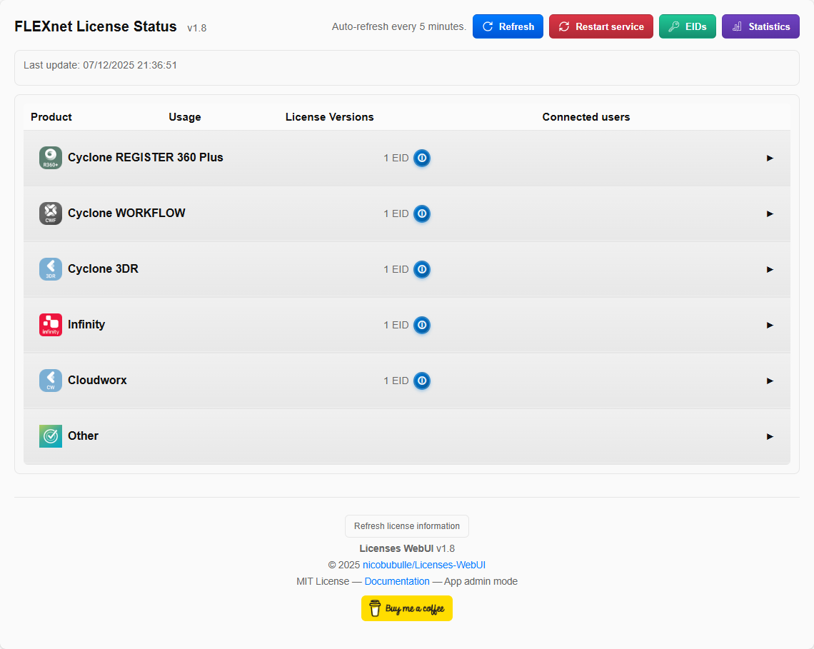
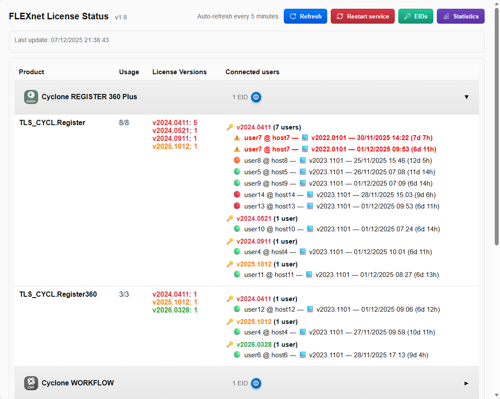
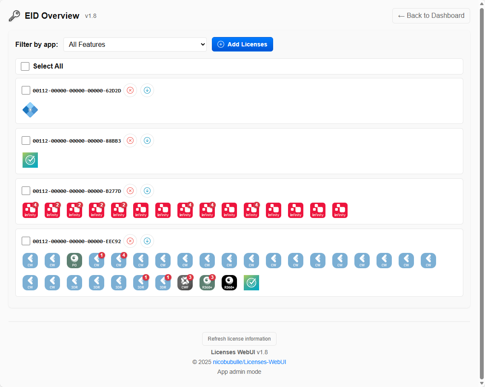
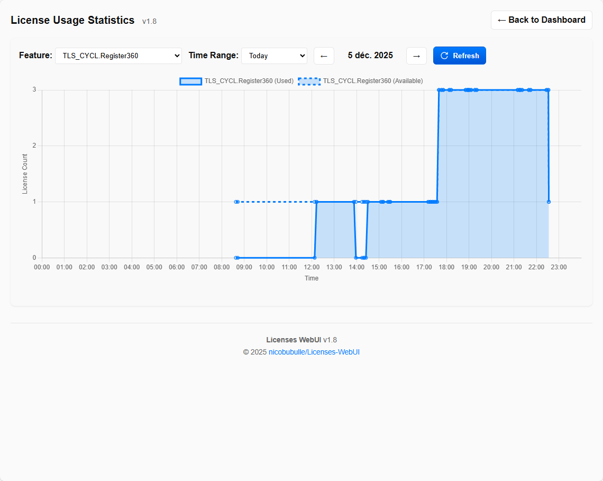

<div align="center">
  
</div>

# Licenses WebUI

<a href="https://buymeacoffee.com/nbullier" target="_blank"></a>

FLEXnet License Status Web UI — small local web app to query lmutil/lmstat and present license usage with an optional system tray and service restart support.

## Features
- Periodic background refresh of lmstat output
- Manual refresh (runs same parsing + notification checkers as background loop)
- **Version Display**: Shows both feature version (🔑) and application version (💻) for each user checkout
  - Feature versions are grouped and sorted in ascending order
  - When maintenance and standard versions differ, the maintenance version is displayed in the feature version header
- **License Versions Column**: Displays per-feature version quantities from `lmstat -a --no-user-info` with 24h cache and unified refresh via the EID button
- **Statistics Dashboard**: Track and visualize license usage over time with interactive graphs (SQLite storage)
- **EID Information**: View detailed EID (Enterprise ID) mappings with feature grouping and license totals (admin-only)
  - **CLM Actions**: Return or Update licenses per EID or in bulk with select-all, modals, and localized status (success, warning for "No updatable items found", errors)
  - **Group Filter**: Filter EIDs by application/group via a dropdown in the EIDs view
  - **License Activation**: Activate license keys directly from the EIDs admin page (same API as dashboard activation)
- **Application Admin Mode**: Secure admin access via randomly generated MD5 key for sensitive features
- Raw output debug view (`/raw`)
- Windows service restart with robust state checking (requires OS admin + enabled in config)
- System tray integration (pystray + Pillow)
- **Feature Grouping**: Organize licenses into collapsible categories with custom icons via `feature_groups.json` (supports exact names and wildcard patterns)
  - **Per-group Maintenance Checking**: Each group can disable maintenance consistency checks via `"check_maint": false` flag
- **Auto-Configuration**: Missing config keys are automatically added with default values on startup
- Internationalization (i18n JSON files: en, fr, de, es) with query/cookie/header locale negotiation
- Automatic GitHub release check (daily) + optional Teams update notification
- Microsoft Teams notifications (Adaptive Card) for:
  - New version available
  - Duplicate license checkouts (same user@computer multiple times for a feature)
  - Extended usage ("extratime" beyond configurable hours threshold, grouped per user)
  - Sold-out feature transitions (becomes fully used / becomes available again)
  - Daemon status (license server down/up detection with service and port verification)
  - **Inconsistent licenses** (user has only standard or only maintenance feature) — respects per-group `check_maint` setting
- Maintenance filtering: optionally hide and suppress notifications for features containing `maint`
- Additional hide filtering via substring list
- Configurable via `config.ini` with atomic file updates and backup creation

## Quickstart (Windows)
> Important: Installation is only required on the server hosting CLM. There is nothing to install on client machines.
1. Download / build the executable and run it (first start will create `config.ini` if missing).
2. Edit `config.ini` as needed (see below). Restart app after changing values.
3. Browser auto-opens at `http://localhost:<web_port>`.
4. Optional: configure Teams notifications (see `TEAMS_SETUP.md`).

### Run at Windows Startup (Optional)
To automatically launch the application when Windows starts:

1. Press `Win + R`, type `shell:startup`, and press Enter
2. Create a shortcut to `Licenses_WebUI.exe` in the opened Startup folder
3. Right-click the shortcut → Properties → Set "Run" to "Minimized" (optional)

Alternatively, use Task Scheduler for more control:
```powershell
# Create a scheduled task to run at logon
schtasks /create /tn "Licenses WebUI" /tr "C:\path\to\Licenses_WebUI.exe" /sc onlogon /rl highest
```

## Screenshots

### Main Dashboard

*Main license overview with feature grouping, version information, and maintenance status indicators*

### Application Details

*Detailed view of user checkouts with version tracking and status*

### EID Overview

*Enterprise ID management with feature mappings and bulk operations*

### License Usage Statistics

*Time-series graphs showing license usage trends over time*

### Core `config.ini` keys (SETTINGS section)
- `lmutil_path`: Full path to `lmutil.exe` (default points to Leica folder).
- `port`: FLEX license manager port (default `27008`).
- `web_port`: Web UI port (default `8080`).
- `refresh_minutes`: Background refresh interval in minutes.
- `default_locale`: Fallback UI locale (`en`, `fr`, `de`, `es`).
- `admin_key`: Auto-generated random MD5 hash for app-level admin authentication (do not share).
- `show_eid_info`: `yes|no` show EID info button to non-admin users (default `no`).
- `hide_list`: Comma-separated substrings; any feature containing one is hidden.
- `enable_restart`: Enable Windows service restart button (requires OS admin elevation on startup).
- `admin_restriction_restart`: `yes|no` restrict restart button to app admin users only (default `yes`).

**Note:** Maintenance features (containing 'maint') are always hidden from display. Users who only have maintenance checkouts (no standard feature) will appear in the standard feature list with a 🔴 indicator.

### DATE_FORMAT section
- `format`: Date/time format string for displaying checkout start dates (default `%d/%m/%Y %H:%M`).
  - Examples provided as comments: `%m/%d/%Y %I:%M %p` (US), `%d.%m.%Y %H:%M` (DE), `%Y-%m-%d %H:%M` (ISO)
  - Elapsed time is automatically appended (e.g., "3h 25m" or "2d 5h")

### SERVICE section
- `service_name`: Display + target for restart functionality.

### TEAMS section (summary)
See `TEAMS_SETUP.md` for full details.
- `enabled`: `yes|no` turns on webhook notifications.
- `webhook`: Incoming webhook URL (keep secret).
- `notify_update`: Notify when a newer GitHub release is found.
- `notify_duplicate_checker`: Duplicate checkout alerts (one per (feature,user,computer)).
- `notify_extratime`: Extended usage alerts (one per (user,computer)).
- `extratime_duration`: Threshold hours (default 72).
- `extratime_exclusion`: Comma-separated features to skip for extratime.
- `notify_soldout`: Sold-out transition alerts.
- `soldout_exclusion`: Comma-separated features to skip for sold-out.
- `notify_daemon`: Daemon status notifications (license server down/up with verification).
- `notify_inconsistent`: Inconsistent license alerts (user has only standard or only maintenance feature).
  - Only checks features in groups where `check_maint` is not `false`

Manual refresh (`POST /refresh`) performs the same parsing and runs duplicate, inconsistent, extratime, and sold-out checkers immediately.

## Endpoints
- `/` — main UI
- `/status` — JSON status (licenses + last_update + eid_info)
- `/refresh` — POST to force synchronous refresh
- `/refresh-eid` — POST to manually refresh EID cache (24-hour TTL, admin-only)
- `/return-license` — POST return/deactivate a license by EID (admin-only)
- `/update-license` — POST update a license by EID (admin-only; "No updatable items found" surfaces as warning)
- `/activate-licenses` — POST activate one or more license keys (admin-only; used by EIDs page activation modal)
- `/refresh-license-versions` — POST to refresh license versions cache (24-hour TTL, admin-only)
- `/restart` — POST to request service restart (OS admin + enable_restart required)
- `/raw` — raw lmstat output for debugging
- `/stats` — statistics dashboard with interactive graphs
- `/eids` — EID overview page with feature mappings (app admin-only)
- `/api/stats` — JSON API for time-series data (query params: `feature`, `hours`)

## Statistics Dashboard
The application automatically tracks license usage changes in a SQLite database (`license_stats.db`) and provides an interactive statistics dashboard at `/stats`.

**Features:**
- Time-series graphs showing used vs. available licenses over time
- Filter by specific feature or view all features
- Configurable time ranges (1 hour to 30 days)
- Auto-refresh every 5 minutes
- Storage only occurs when usage values change (efficient storage)
- Respects `hide_list` settings (maintenance features are always excluded)

Access the dashboard via the "📊 Statistics" button in the main UI toolbar.

## Admin Mode
The application provides an admin mode for accessing sensitive features like the EID overview page, license activation, return/update operations, and other administrative functions.

**Activating Admin Mode:**
There are two ways to activate admin mode:
1. **Via URL parameter**: Append `?admin=<your_admin_key>` to any page URL
2. **Via Admin Modal**: Click the "Admin mode" button in the footer and enter your admin key in the popup

Once authenticated, the session persists for 7 days via a secure cookie.

**Admin Key:**
The admin key is automatically generated on first run and stored in `config.ini` under `[SETTINGS]` as `admin_key`. This is a random MD5 hash that provides application-level authentication. Keep this key secure and do not share it.

**Admin vs Non-Admin:**
- **OS Admin Mode**: Windows administrator privileges (required for service restart button)
- **App Admin Mode**: Application-level authentication via `admin_key` (required for EID page and sensitive features)

These are two separate authentication levels. OS admin mode requires Windows UAC elevation at startup (if `enable_restart = yes`), while app admin mode uses the `admin_key` for web-based authentication.

**Restricting Features:**
- Service restart can be restricted to app admin users via `admin_restriction_restart = yes` in `config.ini`
- EID button visibility for non-admin users can be controlled via `show_eid_info = yes` in `config.ini`

## Version Information Display
Each user checkout displays detailed version information with visual indicators:

**Colorization and Tooltips**
- Feature versions are colorized according to release dates declared in `feature_groups.json` via a `releases` array like `{ "app_version": "2024.0411", "date": "2024-04-11" }`.
- Tooltips are localized using i18n keys: `latest_release`, `last_compatible_release`, and `version_unknown`.
- Users are grouped under the same `feature_version` within a feature, showing a localized count (`users_count` + `users_count_suffix`).

**Version Types:**
- **🔑 Feature Version**: The version of the license feature itself (e.g., v2024.0411)
- **💻 Application Version**: The version of the application the user is running (e.g., v2023.1101)

Both versions are extracted from lmstat output and displayed inline with user information. If version information is unavailable, the UI shows "version unknown" (localized to the user's language).

**Maintenance Status Indicators:**
Users are marked with colored icons indicating their maintenance status:
- **⚫ Gray/Black**: No maintenance feature or maintenance checking disabled for this group
- **🟢 Green**: Has both standard and maintenance features
- **🟠 Orange**: Only has standard feature (no maintenance)
- **🔴 Red**: Only has maintenance feature (automatically moved to standard feature list)
- **⚠️ Warning**: Duplicate checkout detected (same user@computer multiple times)

When a feature group has `"check_maint": false` in `feature_groups.json`, all users in that group show the neutral black icon (⚫) regardless of maintenance status, and no inconsistent license notifications are sent.

Hover over any maintenance icon to see detailed status information in your preferred language.

## EID Information
The application tracks Entitlement ID (EID) information from CLM query-features output and provides a dedicated overview page.

**Requirements:**
- CLM version 2.20 or higher is required for EID functionality
- If CLM is outdated or unavailable, EID features will be automatically hidden
- **Admin mode is required** to access the EID page (see Admin Mode section)

**Features:**
- Maps each EID to its associated features with group icons
- Displays license totals as badges on feature icons
- Aggregates "other" group features into a single icon
- Smart tooltips with viewport awareness
- 24-hour cache with manual refresh capability
- **Return/Update workflows**: Per-EID buttons plus checkbox multi-select (including select-all) with bulk Return/Update, live modal status, and localized messages; update uses warning status when CLM reports "No updatable items found"
- **Activation**: Paste license keys in the EIDs page modal; keys are validated client-side and sent to `/activate-licenses`
- **Filtering**: Dropdown to filter EIDs by application/group defined in `feature_groups.json`
- Column layout: EID number above feature icons

Access the EID page by clicking the "🔑 EID Info" button in the toolbar or navigating directly to `/eids`. Configure `show_eid_info = yes` in `config.ini` to make the EID button visible to non-admin users.

## Feature Grouping
Licenses are automatically organized into collapsible categories with custom icons for easier navigation. Groups are collapsed by default and can be toggled by clicking the header.

**Configuration via `feature_groups.json`:**
- Each group supports exact feature names and wildcard patterns (e.g., `"TLS_CYCL.3DR*"`)
- `check_maint` property (default `true`): controls maintenance consistency checking
  - Set to `false` to disable maintenance status verification for a specific product group
  - When disabled, users show neutral black icon (⚫) and no inconsistent license Teams notifications are sent
- `releases` array: optional release date mapping for version colorization
- `icon` property: custom icon path for visual identification

Example group configuration:
```json
{
  "id": "c3dr",
  "title": "Cyclone 3DR",
  "icon": "static/icons/c3dr.png",
  "check_maint": false,
  "features": ["TLS_CYCL.3DR*"],
  "releases": [
    { "app_version": "2025.0.0", "date": "2024-07-06" }
  ]
}
```

## Internationalization
Translation files live in `i18n/` as JSON. Supported locales are loaded from `app.py` (DEFAULT_LOCALE and SUPPORTED_LOCALES). To add a language:
1. Create `i18n/xx.json` (xx = locale code).
2. Include the same keys as `en.json` and translated values.
3. Add locale code to `SUPPORTED_LOCALES` in `app.py` if needed.

Locale negotiation: `?lang=xx` query param → `lang` cookie → `Accept-Language` → default.

## Configuration details
`config.ini` is created automatically with example values on first run. Missing configuration keys are automatically added with default values when the application starts, and a backup (`.bak`) is created before any updates. Edit and restart the application. Unknown keys are ignored. Percent symbols (%) in webhook URLs are preserved using raw read mode.

Example TEAMS block:
```
[TEAMS]
enabled = yes
webhook = https://outlook.office.com/webhook/....
notify_update = yes
notify_duplicate_checker = yes
notify_inconsistent = yes
notify_extratime = yes
extratime_duration = 72
extratime_exclusion = maint-test,temp-feature
notify_soldout = yes
soldout_exclusion = legacy,trial
notify_daemon = yes
```

## Logs & Troubleshooting
- Logs are written to `logs/Licenses_WebUI.log`.
- If the service restart fails, detailed `sc` output is captured in the returned log for diagnosis.
- Ensure `lmutil.exe` path is correct and that the license manager is reachable.

## Development & Packaging notes
- The app requests elevation at startup if `enable_restart = yes`; accept UAC for restart capability (OS admin mode).
- App admin mode uses `?admin=<key>` URL parameter; session persists via 7-day cookie.
- EID information is cached for 24 hours; refresh via `/refresh-eid` endpoint or EID page button.
- Config file updates are atomic with temporary files and automatic backups (`.bak`).
- Threads: refresh loop, update check loop (daily), systray, optional browser opener.
- Avoid calling request-dependent functions in background threads (already handled).

## Contributing
- Open issues or PRs.
- Keep translations in `i18n/` and update `SUPPORTED_LOCALES` as needed.
 - Include new notification types with clear state tracking to prevent spam.

## Microsoft Teams Integration
For full setup instructions see `TEAMS_SETUP.md`. Adaptive Card payload is sent; messages appear with title, body, and optional "View Details" link for update notifications.

Notification de-duplication rules:
- Update: once per discovered version.
- Duplicate: once per (feature,user,computer) combination.
- Inconsistent: once per (feature,user,computer,status) combination — only for groups with `check_maint` enabled.
- Extratime: once per (user,computer) after threshold; aggregates all exceeding features.
- Sold-out: on state transitions (sold out -> available / available -> sold out).
- Daemon: on state transitions (up -> down / down -> up), verified via service state and port connectivity.

To test quickly:
1. Set `enabled = yes` and supply webhook.
2. Trigger manual refresh or create duplicate sessions.
3. Temporarily lower `extratime_duration` to a small number (e.g., 1) to force extended usage notifications (requires sessions older than threshold).
4. Simulate sold-out by exhausting all licenses for a feature.

## License
MIT